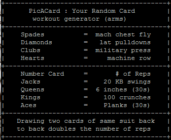

# PicACard
I wrote this script to automate the random generation of workouts for the "deck of cards" work out challenges.  Because lazy. Which is vaguely counterintuitive to the whole working out thing, but... eh.

```
Usage: ./picacard arms
       ./picacard legs
       ./picacard
```
If no option is passed for workout type, workout type is randomly assigned. Core workouts are handled by the face cards.



